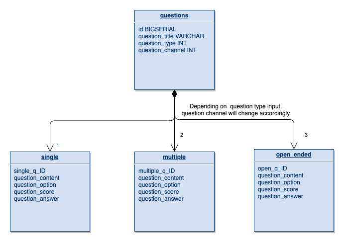

# Question_Bank
A web app to allow user to enter a question according to their choosing. This webapp is using Vue.js for it's front end and is suppose to intergrate Spring Boot framework to handle the API, service and application layers. Postgresql is supposedly used for this project.
# Installation
For Vue.js
1. Enter the client folder and run command "npm install"
2. If, no errors from dependencies, run commnad "npm start"

For Spring Boot
1. Enter the server folder and run command "mvn clean install"
2. If build is succesful run "./mvnw spring-boot:run"

-REMARK
This project is unsuccesful in intergarting the Spring Boot Framework with the postgresql db.
An error appears whenever the project is build.
It's narrowed down that the issue is coming from the JPA dependency of Spring Boot but I am yet to solve this issue. {build is succeful when dependancy is commented out,however it is need to pass data from the front end to the back end}
A version of Spring Boot with that error has been labeled as the "demo"folder. Foolow the isntallation steps for Spring Boot to view the error.

# Database Schema
  
  The question content will depend on the selection made in the question type input this will reference to the question type table accordingly.
  A head on method would be to persisted reference every single field in the single, multiple and open_ended table fields accroding to the question type input.
  
